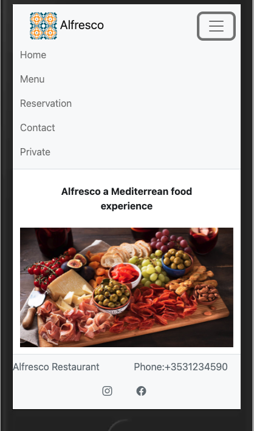
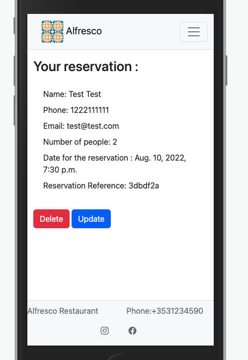
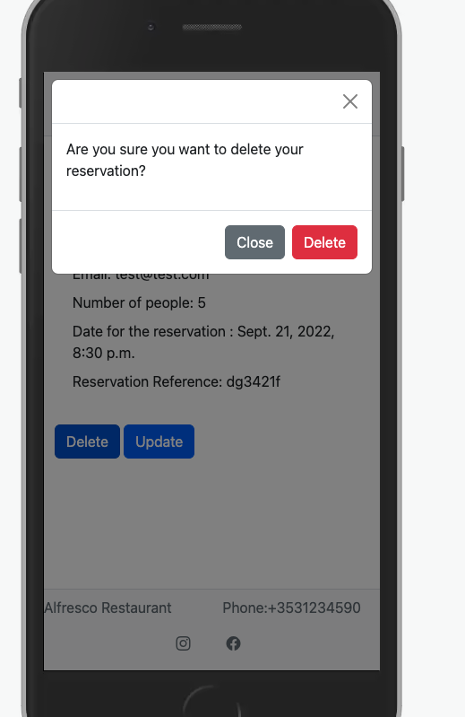
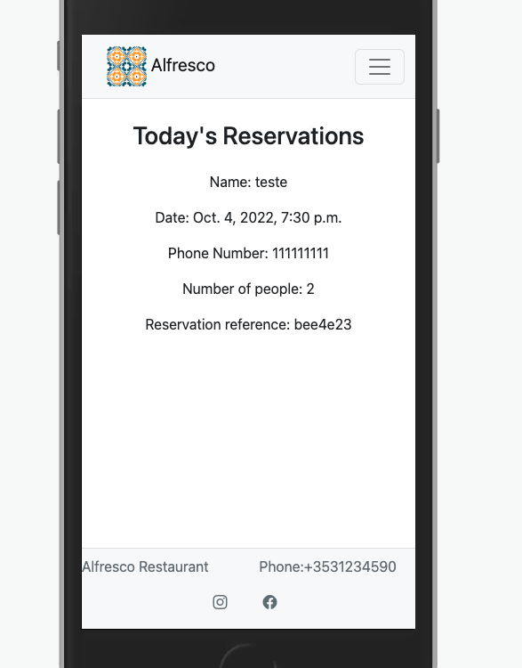

## Purpose of the project
   * This project represent site for alfresco restaurant a mediterrean restaurant. This site will allow clients to make reservations and business owners to see the reservations for the day.
   * Learn outcomes will be: Frameworks, OOP principles, agile, etc..
## User Stories
   * As a visiting user I can browse the website to gain more information
   * As a visiting user I can make a reservations
   * As a recurrent users I can search for my reservations so I can cancel my own reservations
   * As a business owener I can see the number of bookings for the day so I can plan better
## Features
   * Ability to book a date in the selected date
   * Ability to modify a booking
   * Ability for the owner to review the bookings for the day.
## Future features
   * Show historical of bookings
   * Ability to confirm/reject bookings
   * Ability to update/change the menu without editing the code.
## Wireframes
   * Wireframes can be found here <-Link to wireframes
## Technology
   ### Languages
   * HTML
   * CSS
   * Javascript
   * Python
   * Cloudinary
   ### Database
   * PostgresSQL
   ### Framework 
   * Django
   ### Libraries
   * Bootstrap
   * ShortUUID 
     * This external library is used to generate short reservations code to allow user search for their reservations. 

## Testing
   # Test Cases 
   * A user can browse and navigate the site. 
     - Expected behaviour: The page will load and the user will be able to navigate the page. 
       - **Passed**: Upon entering the site url the page loads and the user is able to browse the site using the navbar  
   
   
   * A user can make a reservation
     - Expected behaviour: Users will be presented with a form. Upon filling the form the reservation will be saved into the Database.
       - **Passed**: Confirmation message is displayed after submit the reservation  
          
   * A user can search for their reservations
     - Expected behaviour: A user can use their reservation code to search for their reservation and modify it or delete it. 
       - **Passed**: The existing reservations is displayed to the user with the buttons to delete or update the reservations.  
          
   * A user can delete their reservation
     - Expected behaviour: Upon clicking in the delete button the reservation warning message will appear asking for confirmation before
     deleting the existing reservation. 
       - **Passed**: The modal warning appear asking the user to confirm the deletion 
          
   * A owner can login to the private part of the site
     - Expected behaviour: A business owner can use the Private link in the navbar to login, using their admin login
       - **Passed**:Login is accepted and the page redirect automatically to the list or reservations for the day
   * A owner can see the registration for the day
     - Expected Behaviour: Upon login in the private area it will automatically redirect to a page displaying the day reservations
       - **Passed**: Reservations for the day are displayed upon login
         - 
   # Fixed bugs
     - Adding a space between characters in the phone field breaks the reservation form #47 - **Resolved**
     - Business_login/reservation_list view was displaying reservations list regardless of login status #48 - **Resolved**
   # Supported screens and Browsers
## Deployment
   * Heroku deployment
     - Navigate and login to Heroku and login it 
     - Click in Settings, under builpacks select: 
     - Python, NodeJS in this order first Python, second nodejs 
     - In Config Vars click in Add and add the following
     - PORT , 8000
   - Once that is completed. Click in Deploy
      - In Deploy Method clink under GitHub 
      - Connect your Github repository to Heroku
      - At the bottom under Manual Deployment select the Branch you want to deploy. Main by default
      - Click in Deploy Branch
      - Click in the View button to open deployed app.
## Credits
   * Adding a form to the site to capture user reservations https://www.youtube.com/watch?v=CVEKe39VFu8&list=PLCC34OHNcOtqW9BJmgQPPzUpJ8hl49AGy&index=8
   * Code Institute for providing the template.
