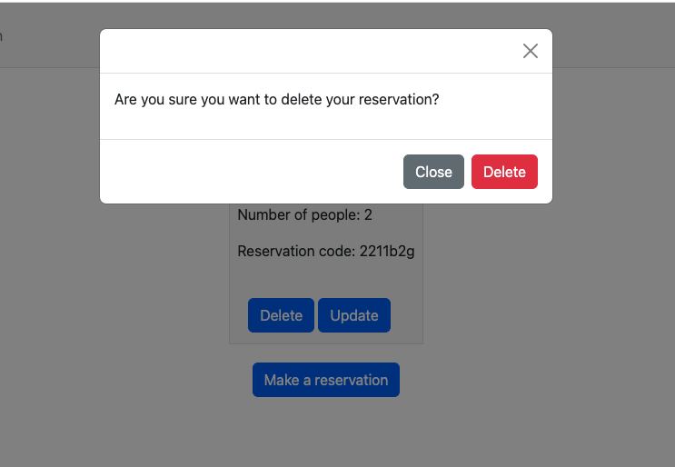

## Purpose of the project
___
   * This project represent site for alfresco restaurant. This site will allow clients to make reservations and business owners to see the reservations for the day. This site was build using Django, PostgreSQL, Python, boostrap was using for the styling.
   * Learn outcomes will be: Frameworks, OOP principles, agile, etc..
## User Stories
| User Story                                                                           | Ticket Number |
| :-----------                                                                         | :----:       |
| As a visiting user I can browse the website                                          | [#2](https://github.com/rfpotrero/alfresco/issues/2)    |
| As a visiting user I can signup and create an account                                | [#49](https://github.com/rfpotrero/alfresco/issues/49)       |
| As a visiting user I can login to the website                                        | [#65](https://github.com/rfpotrero/alfresco/issues/65)       |
| As a visiting user I can make a reservations                                         | [#3](https://github.com/rfpotrero/alfresco/issues/3)       |
| As a recurrent users I can see my reservations and update them                       | [#25](https://github.com/rfpotrero/alfresco/issues/25)       |
| As an admin  I can see the number of bookings in Admin                               | [#66](https://github.com/rfpotrero/alfresco/issues/66)       |

## Features
___
   * Ability to make a reservation on the specific date and time
   * Ability to modify a reservation
   * Ability to see coming reservation
   * Ability for admin to see the reservations sorted by date
## Future features
___
   * Show historical of bookings
   * Ability to confirm/reject bookings
   * Ability to update/change the menu without editing the code.
## Desing and Diagrams
___
   ### Database Diagrams
   * ER diagram 
     
     
   ### Wireframes
   * Wireframes can be found [HERE](/assets/wireframes).
   

## Technology
___
   ### Languages
   * HTML
   * CSS
   * Javascript
   * Python 3.8
   * [Cloudinary](https://cloudinary.com/)
     * API to store images and made accessible in the live site.
   ### Database
   * PostgresSQL
     * Heroky PostgreSQL version 14.5
   ### Framework 
   * Django 4.0
   ### Libraries
   * [Bootstrap 5.2](https://getbootstrap.com/docs/5.2/getting-started/introduction/)
     * Use to style the site
   * [phonenumbers](https://django-phonenumber-field.readthedocs.io/en/latest/)
     * A external Django library which interfaces with python-phonenumbers to validate phone numbers. This was used to build the phonenumber model.
   * [ShortUUID](https://pypi.org/project/shortuuid/)
     * External library used to generate short reservations code to allow user search for their reservations. 

## Test Cases 
___
* A user can browse and navigate the site. 
   - Expected behaviour: The page will load and the user will be able to navigate the page. 
      - **Passed**: Upon entering the site url the page loads and the user is able to browse the site using the navbar  
  
  
* A visiting user can singup and create an account
- **Passed**: The user is redirected to the reservations page upon account creation. Validation prevent duplicate usernames and email.
      
      
* A visiting user can login/logout from their account
  - Expected behaviour: A user can login/logout from their account. Upon login in the button will change to logout
    - **Passed**: Upon login the button change to logout 
  
        
        
* A logged user can make a reservation
- Expected behaviour: Users will be presented with a form. Upon filling the form the reservation will be saved into the Database.
  - **Passed**: Confirmation is displayed after submit the reservation  
      
      
* A logged user can update their reservation
- Expected behaviour: Upon clicking in the update button the reservation warning message will appear asking for confirmation before
updating the existing reservation. 
  - **Passed**: Modal appear and after confirm the reservation is updated
  
* A logged user can delete their reservation
- Expected behaviour: Upon clicking in the delete button the reservation warning message will appear asking for confirmation before
deleting the existing reservation. 
  - **Passed**: The modal warning appear asking the user to confirm the deletion.
  
* An admin can login to see the reservations
- Expected behaviour: An admin will be able to see the current reservations.
   - **Passed**:Pass in the admin panel reservations are displayed showing the fields defines in admin.py
   
## Fixed bugs
___
- Adding a space between characters in the phone field breaks the reservation form [#47](https://github.com/rfpotrero/alfresco/issues/47) - **Resolved**
- After signing up error page is displayed [#63](https://github.com/rfpotrero/alfresco/issues/63) **Resolved**
- Password reset link was displaying an error [#64](https://github.com/rfpotrero/alfresco/issues/64) **Resolved**
## Supported screens and Browsers
___
   - Google Chrome 
   - Mobile. Mobile first design was use here. Responsiveness was achieve using bootstrap
## Deployment
___
   * Heroku deployment   
     - Browse to heroku and login
     - Upper right corner. Click in New and select New App
     - Choose a Name for the app and a Region
     - Click in your App name if you are not redirect to it. 
     - Click in Settings, under builpacks select: 
       - Heroku/Python
     - Click in Resources
     - In add-on search for Heroku Postgres 
     - Click in Settings again
     - Click Reveal Config Vars
     - In Config Vars click in Add and add the following
       - CLOUDINARY_URL - An account from Cloudinary is required. 
         - Cloudinary Setup
         - Visit the [Cloudinary website](https://cloudinary.com/)
         - Click on the Sign Up For Free button
         - Provide your name, email address and choose a password
         - For Primary interest, you can choose Programmable Media for image and video API
         - Optional: edit your assigned cloud name to something more memorable
         - Click Create Account
         - Verify your email and you will be brought to the dashboard
       - DATABASE_URL - This will be added automatically by Heroku
       - DISABLE_COLLECTSTATIC - 1
       - SECRET_KEY - Secret Key from Django
       - PORT - 8000
     - Return to your Code Editor where your code lives
     - Create a Procfile
       - Inside enter web: gunicorn alfresco.wsgi
     - In settings.py navigate to ALLOWED_HOST
       - Add heroku APP URL 
     - In settings.py set DEBUG=False
     - Run pip3 freeze >> requirements.txt to ensure packages and libraries are captured.
     - Commit and push your code as needed.
     - If there any issue during Heroky deployment do the following
       - Create a runtime.txt file in your django root 
         - Inside that file enter python-3.8.13
     - Once that is completed. Click in Deploy
       - In Deploy Method clink under GitHub 
       - Connect your Github repository to Heroku
       - At the bottom under Manual Deployment select the Branch you want to deploy. Main by default
       - Click in Deploy Branch
       - Click in the View button to open deployed app.
   * Local deployment
     - Clone the repository 
     - Ensure your ENV variables are correct
     - Run the command python3 manage.py migrate if required.
     - Run the command python3 manage.py runserver
     - In settings.py modify ALLOWED_HOST to resolve any connectivity issues.
      

## Credits
___
   * Adding a form to the site to capture user reservations https://www.youtube.com/watch?v=CVEKe39VFu8&list=PLCC34OHNcOtqW9BJmgQPPzUpJ8hl49AGy&index=8
   * Official docummenation from https://getbootstrap.com/, https://djangoproject.com
   * Code Institute for providing the template and the training material
